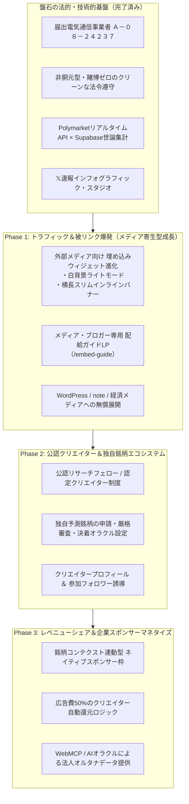

# 🗺️ 未来レーダー マスターグロース・ロードマップ（2026–2027）
### 〜 メディア向けウィジェット配給・公認クリエイターエコシステム・レベニューシェア設計 〜

---

## 🏛️ エグゼクティブ・サマリー

* **サービス名称**: 未来レーダー（MiraiRadar.com）
* **運営主体**: ＤＥＬＩＣＩＯＵＳ株式会社
* **届出電気通信事業者**: **総務省 関東総合通信局 届出番号 Ａ－０８－２４２３７**
* **コア・バリュー**:
  世界最大予測市場（Polymarket等）が弾き出す「冷酷なリアルマネー確率」と、日本国内の生活者が捉える「直感的な生世論」を対比。賭博性ゼロ・完全無料・1秒投票で、日本社会に真の「未来オラクル（客観的予測データ）」を提供する日本初の公共インテリジェンス・メディア。



---

# 🚀 Phase 1：大手メディア・ブログ向け インタラクティブ埋め込みウィジェットの全方位配給

記事の鮮度を維持したい外部Webメディアや個人ブロガーを**「未来レーダーの無料集客エンジン」**へと変貌させる施策です。

### 1.1 ウィジェットの機能強化（3大アップデート）
1. **ライトモード（白背景 / クリーンテーマ）**:
   * URLパラメータ: `https://mirairadar.com/embed/{slug_or_id}?theme=light`
   * note、WordPressブログ、白基調の大手ニュースメディア（東洋経済、日経、ITmedia等）に自然に溶け込む、洗練された白ベース・高コントラストUI。
2. **インライン・バナー型レイアウト（横長 / 680×160px）**:
   * URLパラメータ: `https://mirairadar.com/embed/{slug_or_id}?layout=banner`
   * 記事の段落と段落の間にスッと自然に差し込めるスリムな横長オッズバー（記事本文の読書体験を邪魔しない設計）。
3. **完全レスポンシブ ＆ 1秒即時投票**:
   * 外部記事を読んでいるユーザーが、画面を離れることなくその場で「YES/NO」に投票可能。

### 1.2 メディア専用 配給ポータル（`/embed-guide`）の設置
* **ターゲット**: 経済・政治・テック系Webメディア編集部、株式・仮想通貨ブロガー、noteクリエイター。
* **提供機能**:
  * 全銘柄のリアルタイム検索 ＆ プレビュー切り替え（ダーク/ライト、カード/バナー）。
  * ワンクリックで生成される `<iframe>` コピーコード。
  * WordPress用ブロック（カスタムHTML）貼り付けガイド。
* **狙い**:
  * 外部サイトに設置されるたびに**「powered by 未来レーダー」の高品質な被リンク（dofollow）**と、数十万人の潜在読者の自然流入を獲得。

---

# 🎓 Phase 2：公認インテリジェンス・クリエイター制度（独自銘柄エコシステム）

専門家、ジャーナリスト、業界アナリストに「自分の予測銘柄」を作らせ、彼らの既存フォロワーを未来レーダーへ総動員させる仕組みです。

### 2.1 クリエイター・アナリスト認定制度
| ランク | 対象 | 権限 | 特典 |
| :--- | :--- | :--- | :--- |
| **公認フェロー**<br>*(Certified Fellow)* | 著名エコノミスト、有名ジャーナリスト、各界トップインフルエンサー（招待制） | 独自銘柄の即時上場（優先審査）、公式特集枠掲載 | 公式認証ブルーバッジ、レベニューシェア優先枠（最大60%） |
| **認定クリエイター**<br>*(Verified Creator)* | 専門分野（AI・防衛・金融・スポーツ等）で実績のあるリサーチャー（申請・審査制） | 独自銘柄の月間5本上場 | 認証グリーンバッジ、レベニューシェア（50%） |
| **一般観測者**<br>*(Public Citizen)* | 全一般ユーザー（登録不要） | 「銘柄提案フォーム」からの提案（運営審査後に採用） | 採用時にサイトクレジット表記 |

### 2.2 独自銘柄の上場審査基準（デマ・陰謀論の100%排除）
公認クリエイターが作成する銘柄は、以下の**「3大上場基準」**を自動クリアする形式をとります：
1. **客観的決着オラクル（URL必須）**: 官公庁発表、公式統計、主催者リリースなど「判定に争いの余地がないURL」を事前指定。
2. **問いの中立性**: 「〜〜は良い政策か？」ではなく「2026年12月までに〜〜が成立するか？」という事実判定形式。
3. **公共性・非誹謗中傷**: 個人の名誉毀損・プライバシー侵害・生死に関わるゴシップの禁止。

### 2.3 クリエイター自身の拡散ループ
* クリエイターは自分の銘柄が盛り上がる（PV・投票数が増える）ほど収益と認知度が高まるため、**「私が立てた最新予測に投票してください！」と自身のXやYouTube、メルマガで自発的に宣伝**。運営費ゼロでのインフルエンサーマーケティングを実現。

---

# 💰 Phase 3：レベニューシェア ＆ コンテクスト・スポンサーシップ（収益化エンジン）

「ガチャ」や「ユーザー課金」「賭博手数料」に一切頼らず、**「メディアとしての最高峰の信用」**を収益化します。

### 3.1 銘柄コンテクスト連動型 ネイティブスポンサー枠
* **仕組み**:
  * 各銘柄の詳細ページ下部や投票完了画面に、**そのテーマに最も関心の高い企業がスポンサーとして掲載**される。
  * *例1*: 「日銀の利上げ予測」銘柄 ➔ 大手証券会社・FX会社の純広告や口座開設キャンペーン。
  * *例2*: 「生成AIの法規制」銘柄 ➔ クラウドベンダー・AIスタートアップの導入事例リンク。
  * *例3*: 「防衛・宇宙技術」銘柄 ➔ 航空宇宙・テクノロジー企業の公式ブランディング。
* **特徴**:
  * 不快なアドネットワーク（怪しい広告や追跡バナー）を全廃し、**記事の文脈に溶け込む上質な企業スポンサーシップ**のみを採用。

### 3.2 50% レベニューシェア（広告収益分配）モデル
* **分配ロジック**:
  ```text
  クリエイター取り分 ＝ 該当銘柄ページで発生した純スポンサー収益 × 50%
  ```
* **効果**:
  * 「未来レーダーで良質な銘柄を立てて1万人の投票を集めれば、記事広告収益の半分が入る」という明確な経済インセンティブにより、日本中の優秀なアナリストがこぞって銘柄を供給するプラットフォームへ成長。

### 3.3 B2B / シンクタンク・AIオラクル（WebMCP）オルタナティブデータ販売
* 日本唯一の「世界オッズ × 日本人生世論」の構造化データ（時系列データ）を、機関投資家、シンクタンク、大学研究機関、およびAI開発企業向けに高付加価値APIとしてライセンス提供。

---

## 📅 アクションプラン・実装マイルストーン

| マイルストーン | 期間 | 主要タスク | 期待成果 |
| :--- | :--- | :--- | :--- |
| **M1: ウィジェット進化** | 次回セッション〜 | ・`EmbedWidgetPage.tsx` に白背景ライトモード追加<br>・横長インラインバナー（680×160）レイアウト追加<br>・`EmbedModal.tsx` にプレビュー＆コピーUI統合 | 外部メディアへの配給準備完了 |
| **M2: メディアLP開設** | 2026年9月中旬 | ・`/embed-guide`（メディア向けウィジェット無料配給LP）公開<br>・金融・テック系ブログ、noteへの掲載呼びかけ | 初期被リンク30本、月間5万セッション純増 |
| **M3: クリエイター制度設計** | 2026年9月下旬 | ・クリエイター認定基準の策定<br>・独自銘柄申請フォーム＆審査コンソールの実装<br>・公認フェロー第1期（10名）の招待 | 専門家発の独自予測銘柄の供給開始 |
| **M4: スポンサー枠＆還元開始**| 2026年10月〜 | ・ネイティブスポンサー枠の実装<br>・レベニューシェア集計機能の導入<br>・第1号スポンサー企業の獲得 | 自律的マネタイズエンジンの本格稼働 |

---

*作成日: 2026年9月7日 ｜ ＤＥＬＩＣＩＯＵＳ株式会社 経営企画・プロダクト統括*
